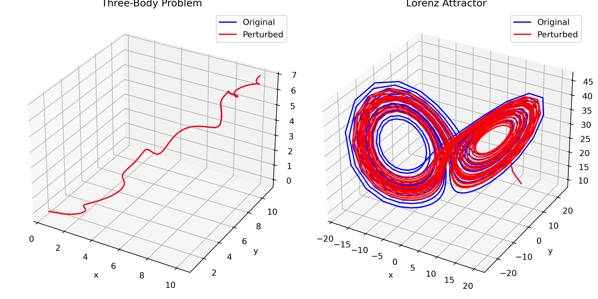
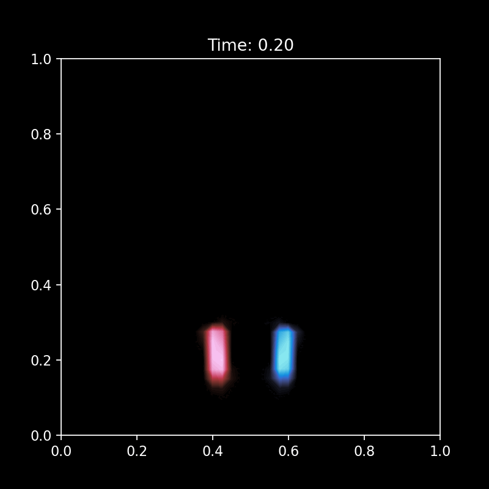
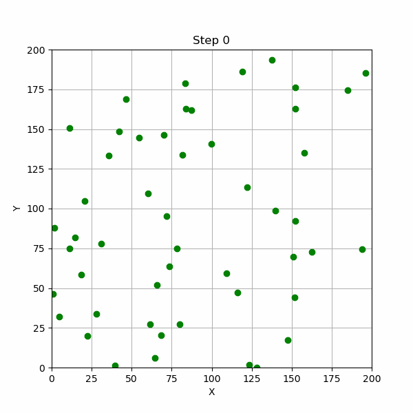
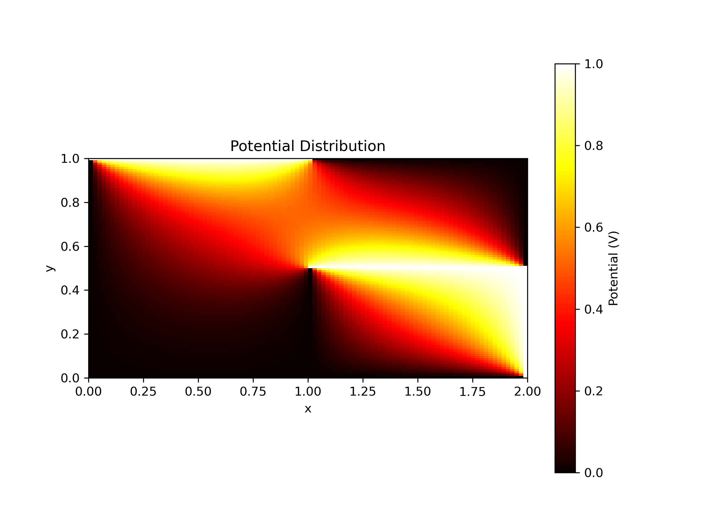

# Computational Physics Simulations


A collection of numerical physics simulations implemented from scratch in Python, covering topics from chaotic dynamical systems and fluid dynamics to statistical mechanics and molecular dynamics. Built as part of a **Numerical Simulation** course at the bachelor's level.

---

## 📌 Simulations

### 🌀 Chaotic Dynamics & Lorenz System
**File:** `chaotic dynamics.ipynb` · `Chaos (lorenz systems).pdf`

Explores deterministic chaos through the famous **Lorenz attractor** — a system of three coupled ODEs originally derived to model atmospheric convection. Demonstrates sensitive dependence on initial conditions (the "butterfly effect") and visualizes the iconic strange attractor in 3D phase space.



**Key concepts:** Strange attractors · Lyapunov exponents · Phase space trajectories · Sensitivity to initial conditions

---

### 💧 Navier-Stokes Fluid Simulation
**File:** `Navier-Stokes.ipynb`

Numerically solves the incompressible **Navier-Stokes equations** on a 2D grid to simulate viscous fluid flow. Implements pressure-velocity coupling and visualizes velocity fields and streamlines, giving insight into fundamental fluid dynamics behavior such as vortex formation.



**Key concepts:** Finite difference methods · Incompressible flow · Vorticity

---

### ⚛️ Ising Model — Ferromagnetism
**File:** `ising model(ferromagnetism).ipynb`

Simulates the **2D Ising model** of ferromagnetism using the Metropolis-Hastings Monte Carlo algorithm. Models a lattice of magnetic spins and demonstrates the **phase transition** from an ordered (ferromagnetic) to a disordered (paramagnetic) state as temperature increases past the critical Curie temperature.

**Key concepts:** Monte Carlo simulation · Metropolis algorithm · Phase transitions · Statistical mechanics · Magnetization

---

### 🧪 Molecular Dynamics (MD) Simulation
**File:** `Verlet Algorithm.ipynb` · `MD simulation.pdf`

Implements a **molecular dynamics simulation** using the **Verlet integration algorithm** to evolve particle positions and velocities over time under a Lennard-Jones potential. Tracks thermodynamic observables like total energy and temperature, and demonstrates how microscopic particle interactions give rise to macroscopic behavior.



**Key concepts:** Verlet integration · Lennard-Jones potential · Energy conservation · Newton's equations of motion

---

### 🔗 Coupled Differential Equations
**File:** `Coupled Differential eq.ipynb`

Solves systems of **coupled ordinary differential equations** numerically, with applications to coupled oscillators and other multi-body physics problems. Compares numerical solutions against analytical results and explores how coupling strength affects system behavior.

**Key concepts:** ODE systems · RK4 integration

---

### ⚡ Laplace Equation — Electrostatics
**File:** `laplace equation.ipynb`

Solves the **Laplace equation** (∇²φ = 0) in 2D to find electrostatic potential distributions using iterative relaxation methods (Jacobi/Gauss-Seidel). Visualizes equipotential lines and electric field vectors for various boundary conditions.



**Key concepts:** Finite difference method · Boundary value problems · Relaxation methods · Electrostatic potential

---

## 🔌 Installation & Usage

### Requirements

```bash
pip install numpy scipy matplotlib jupyter
```

### Running the simulations

1. Clone the repository:
   ```bash
   git clone https://github.com/nimayadollahi/Physics-simulations.git
   cd Physics-simulations
   ```

2. Launch Jupyter:
   ```bash
   jupyter notebook
   ```

3. Open any `.ipynb` file and run all cells (`Kernel → Restart & Run All`).

### Dependencies overview

| Package | Purpose |
|---|---|
| `numpy` | Array operations, linear algebra |
| `scipy` | ODE solvers, signal processing |
| `matplotlib` | 2D/3D plotting and animations |
| `jupyter` | Interactive notebook environment |

---

## Methods Summary

| Simulation | Numerical Method |
|---|---|
| Lorenz / Chaotic Dynamics | Runge-Kutta 4th order (RK4) |
| Navier-Stokes | Finite difference, pressure projection |
| Ising Model | Metropolis Monte Carlo |
| Molecular Dynamics | Verlet integration |
| Coupled ODEs | RK4 / SciPy `solve_ivp` |
| Laplace Equation | Jacobi / Gauss-Seidel relaxation |

---

## 📁 Repository Structure

```
Physics-simulations/
│
├── Chaos/
│   ├── chaotic dynamics.ipynb
│   └── Chaos (lorenz systems).pdf
├── Fluid dynamics/
│   └── Navier-Stokes.ipynb
├── Phase transition/
│   ├── ising model(ferromagnetism).ipynb
│   └── ising model.pdf
├── Molcular dynamics/
│   ├── Verlet Algorithm.ipynb
│   └── MD simulation.pdf
├── ODEs/
│   └── Coupled Differential eq.ipynb
├── Electrostatics/
│   └── laplace equation.ipynb
└── README.md
```

---

## 💳 License

This project is open source and available under the [MIT License](LICENSE).

---

## 📟 Author

[](https://www.linkedin.com/in/nima-yadollahi-669893279/)
[](https://github.com/nimayadollahi)
---

*If you find this repository useful, please consider giving it a ⭐ — it helps others discover it!*


